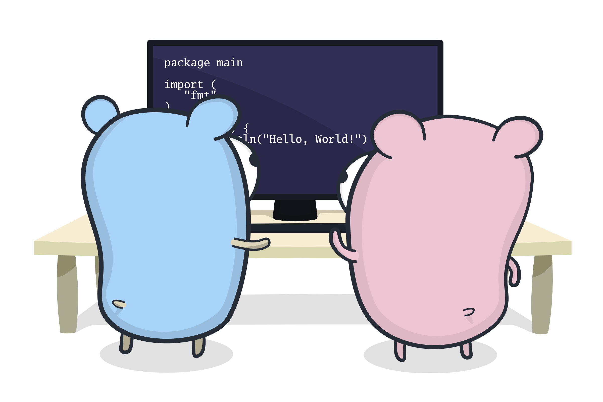

## [`play-with-go.dev`](https://play-with-go.dev/)

[`play-with-go.dev`](https://play-with-go.dev/) is a series of hands-on, interactive, browser-based guides that
introduce the tools required to work with [the Go programming language](https://golang.org/). It is the natural next
step after ["A Tour of Go"](https://tour.golang.org/welcome/1) which introduces the language itself. `play-with-go.dev`
covers the various subcommands of the `go` command, [`staticcheck`](https://staticcheck.io/) and many other tools that
will make writing Go programs that much easier and fun!

To get started learning with `play-with-go.dev`, simply visit https://play-with-go.dev/.

If you are interested in learning more about the project, in particular how to contribute, please see the [contribution
guidelines](CONTRIBUTING.md).

The `play-with-go.dev` splash image was kindly created for the project by [Egon Elbre](https://twitter.com/egonelbre).

### Community

`play-with-go.dev` is an experiment designed to test the hypothesis that interactive guides are a more engaging medium
for learning when it comes to developer tools. The `go` command and modules lend themselves very well to this type of
guide therefore. We need your feedback and suggestions to help steer `play-with-go.dev` in the right direction!

`play-with-go.dev` is very much by the community, for the community. The goal is to build a platform of high quality,
reviewed and curated content, with a diverse, inclusive and sustainable model for having people contribute and maintain
that content.  We want to make it easy for people to contribute and review content, enabled by tooling and continuous
integration checks.

### About the authors

`play-with-go.dev` was created by [Paul Jolly](https://twitter.com/_myitcv) and [Marcos
Nils](https://twitter.com/marcosnils). Guides are built using the popular
[`play-with-docker`](https://github.com/play-with-docker/play-with-docker) platform (created by [Marcos
Nils](https://twitter.com/marcosnils) and [Jonathan Leibiusky](https://twitter.com/xetorthio)). Guides are served via
https://play-with-go.dev/ and run in a user's browser, presenting the guide content on the left, and an interactive
terminal on the right. This terminal is connected to a remote session hosted in [Google's
Cloud](https://cloud.google.com/).

Potential future enhancements to `play-with-go.dev` include:

* integrating [Visual Studio Code](https://code.visualstudio.com/) in the remote session, to enable editing files
* supporting different language translations of a guide (that all share the same script)
* supporting multiple scenarios (multiple platforms, different tool versions) of the same guide

If you have any questions, please feel free to raise an issue or [contact us directly](mailto:contact@play-with-go.dev).

### Sponsors

The `play-with-go.dev` project exists free of charge thanks to the generosity of our sponsors (details to follow).

We are looking to broaden that sponsorship base to meet ongoing hosting costs, but also to start a programme of rewarding
contributors and reviewers.

If you or your company would like to sponsor the project, please [contact us](mailto:sponsor@play-with-go.dev).

### Thanks

Thank you to the following individuals for their help in making `play-with-go.dev` happen: [Carmen
Andoh](https://twitter.com/carmatrocity), [Marcel van Lohuizen](https://twitter.com/mpvl_), [Daniel
Martí](https://twitter.com/mvdan_), [Roger Peppe](https://twitter.com/rogpeppe), [Bill
Kennedy](https://twitter.com/goinggodotnet), [Jon Calhoun](https://twitter.com/joncalhoun), [Cory
LaNou](https://twitter.com/corylanou), [Johnny Boursiquot](https://twitter.com/jboursiquot), [Michael
VanSickle](https://twitter.com/vansimke), [Egon Elbre](https://twitter.com/egonelbre).

